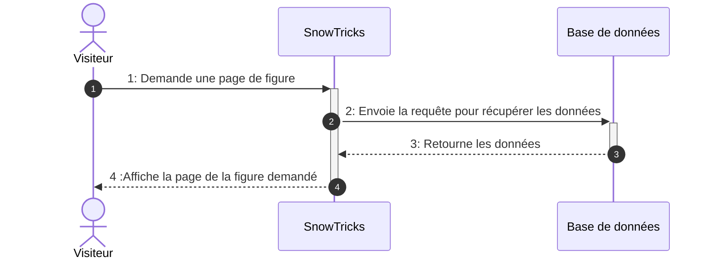
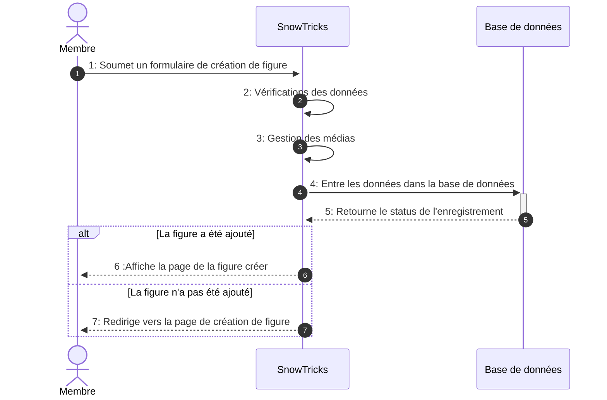
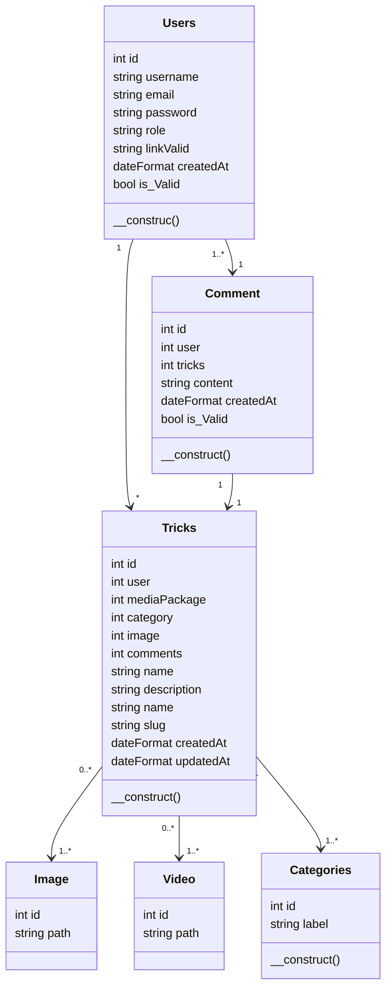
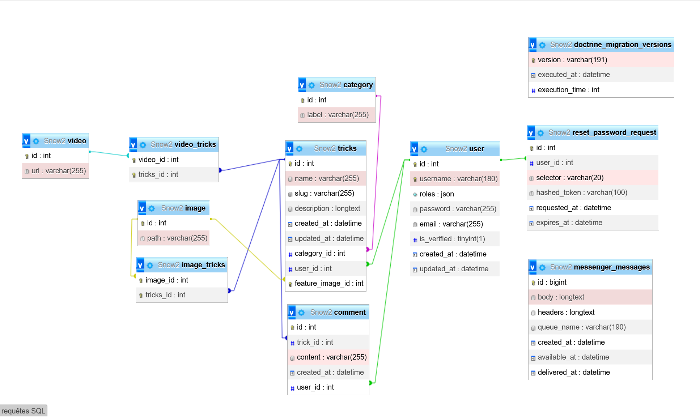

# Ensemble des diagrammes UML

### Un visiteur consulte le site 

```mermaid
sequenceDiagram
    autonumber
    actor V as Visiteur
    participant Site as SnowTricks
    participant BDD as Base de données

    V->>+Site: 1: Demande une page de figure
    Site->>+BDD: 2: Envoie la requête pour récupérer les données
    BDD-->>-Site: 3: Retourne les données
    Site-->>-V: 4 :Affiche la page de la figure demandé

```
<!-- 
 -->

### Un utilisteur soumet une figure

```mermaid
sequenceDiagram
    autonumber
    actor V as Membre
    participant Site as SnowTricks
    participant BDD as Base de données

    V->>+Site: 1: Soumet un formulaire de création de figure
    Site->>Site: 2: Vérifications des données
    Site->>Site: 3: Gestion des médias
    Site->>+BDD: 4: Entre les données dans la base de données
    BDD-->>-Site: 5: Retourne le status de l'enregistrement
    alt La figure a été ajouté
    Site-->>+V: 6 :Affiche la page de la figure créer
    else La figure n'a pas été ajouté
    Site-->>+V: 7: Redirige vers la page de création de figure
    end
```
### Modèle conceptuel de données

```mermaid
classDiagram
    Users "1" --> "*" Tricks
    Users "1..*" --> "1" Comment
    Comment "1" --> "1" Tricks
    Tricks "0..*" --> "1..*" Image
    Tricks "0..*" --> "1..*" Video
    Tricks "1" --> "1..*" Categories

    class Tricks{
      int id
      int user
      int mediaPackage
      int category
      int image
      int comments
      string name
      string description
      string name
      string slug
      dateFormat createdAt
      dateFormat updatedAt

      __construct()

    }

    class Image{
      int id
      string path
    }

    class Video{
      int id
      string path
    }
    class Categories{
        int id
        string label
        __construct()
    }
    class Comment{
        int id
        int user
        int tricks
        string content
        dateFormat createdAt
        bool is_Valid
        __construct()
    }
    class Users{
        int id
        string username
        string email
        string password
        string role
        string linkValid
        dateFormat createdAt
        bool is_Valid
        __construc()
    }

```
### Modèles physique de données :
